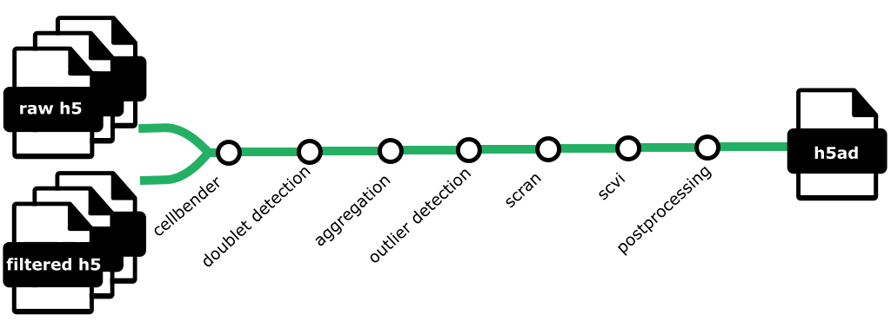

## Introduction

A bioinformatics pipeline that preprocesses single-cell RNA-seq data. It takes a samplesheet and CellRanger raw filtered count matrix as input, performs ambient RNA correction, doublet detection, sample aggregation, batch integration.



## Usage

> [!NOTE]
> If you are new to Nextflow and nf-core, please refer to [this page](https://nf-co.re/docs/usage/installation) on how to set-up Nextflow. Make sure to [test your setup](https://nf-co.re/docs/usage/introduction#how-to-run-a-pipeline) with `-profile test` before running the workflow on actual data.

First, prepare a samplesheet with your input data that looks as follows, where each row contains the sample name, a raw count HDF5 file and a filtered count HDF5 file from CellRanger.

`samplesheet.csv`:
```csv
sample,raw_h5, filtered_h5
CONTROL_REP1,raw_feature_bc_matrix.h5,filtered_feature_bc_matrix.h5
```

Next, prepare a parameter YAML file that looks as follows:

`params.yml`:
```yaml
samplesheet: "./samplesheet.csv"      # Path to the sample sheet
outdir: "./out/"                      # Output directory
experiment:
    name: "experiment"                # Output file prefix
cellbender:                           # Cellbender parameters (see bin/cellbender.py)
    total_droplets_included: 50000
scvi:                                 # SCVI parameters (see bin/scvi_norm.py)
    n_latent: 50
    n_top_genes: 1000                 # Note: large values might give error in writing h5ad
postprocessing:                       # Postprocessing parameters (see bin/postprocessing.py)
   n_pca_components: 100
with_gpu: true                        # Using GPU
maxForks: 2                           # Maximum number of processes in parallel (e.g # of GPU)
max_memory: "6.GB"                    # Memory
max_cpus: 6                           # Number of CPU
```

Now, you can run the pipeline. For local run on HPC with singularity installed, execute the following command

```bash
nextflow run ./main.nf \
   -profile singularity \
   -params-file ./params.yml \
   -w ./work/
```

If you are using MSKCC lilac, you can use the pre-defined `lilac` profile that uses the LSF executor.
```bash
nextflow run ./main.nf \
   -profile lilac \
   -params-file ./params.yml \
   -w ./work/
```
